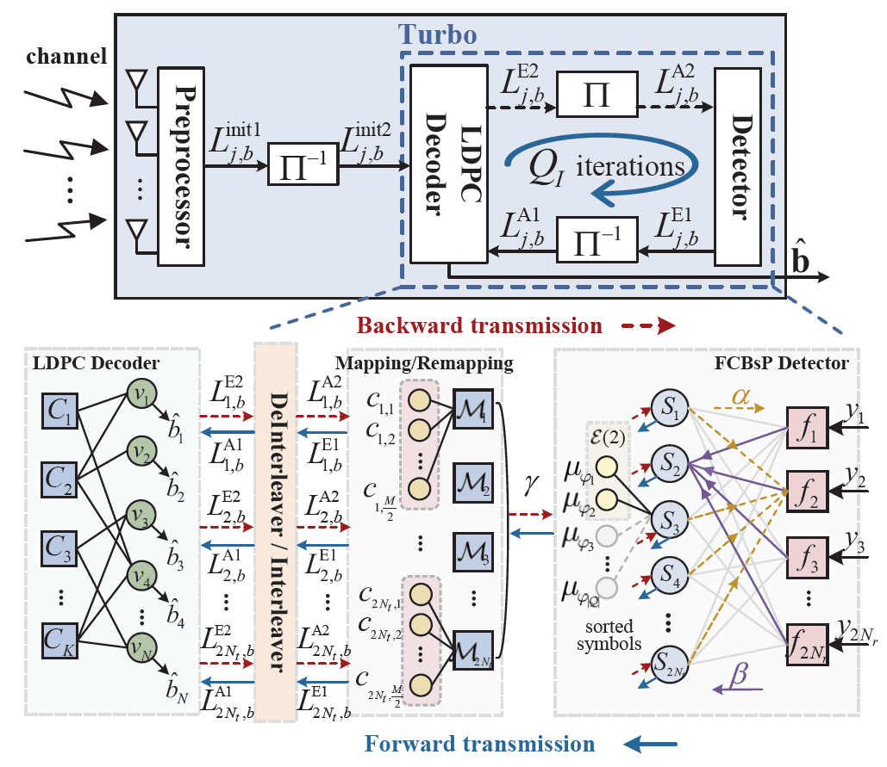

  

    <ul class="home-header-menu pure-menu-list">
      <li class="pure-menu-item"><a href="#about" class="pure-menu-link">About</a></li>
      <li class="pure-menu-item"><a href="#education" class="pure-menu-link">Education</a></li>
      <li class="pure-menu-item"><a href="#news" class="pure-menu-link">News</a></li>
      <li class="pure-menu-item"><a href="#research" class="pure-menu-link">Research</a></li>
      <li class="pure-menu-item"><a href="#publications" class="pure-menu-link">Publications</a></li>
    </ul>
  

## 👋 About {#about} 

Welcome! I’m **Wenyue Zhou**, an PostDoc in Information Engineering at [Purple Mountain Laboratory (PML)](https://www.pmlabs.com.cn/), China, under the supervision of [Prof. Chuan Zhang](https://scholar.google.com/citations?user=iWOmEqMAAAAJ&hl=zh-CN&oi=ao) and [Prof. Xiaohu You](https://scholar.google.com/citations?user=ePea8JMAAAAJ&hl=zh-CN).

---

## 🎓 Education {#education}

- *2021 - 2025*, PhD, Information and Communication Engineering, Southeast University, Nanjing, China.
- *2017 – 2020* M.Eng., Communications Engineering, Anhui University, Hefei, China 
- *2013 – 2017* B.Eng., Communications Engineering, Anhui University, Hefei, China  

---

## 🔥 News {#news}

- *2026.01*: &nbsp;🎉 [FCBsP Turbo Receiver](https://ieeexplore.ieee.org/document/11358997) was published at IEEE TWC!
- *2025.10*: &nbsp;🎉 I received the National Scholarship!
- *2025.01*: &nbsp;🎉 [TrellisBsP Detector](https://ieeexplore.ieee.org/abstract/document/10839355) was published at IEEE WCL!

---

## 🧠 Research {#research}

My research interests focus on:
- Signal Processing for Massive MIMO Systems
- Machine Learning for Efficient Wireless Communications and Networks
- Integrated Sensing and Communication (ISAC)
- Hardware–Algorithm Co-Optimization for Low-Power Signal Processing 
- Memristor-Based Architectures for Energy-Efficient Baseband Signal Processing

---

## 📝 Publications {#publications}

### Published Journals

  

    

      
TWC 2026

      
    

  

  

[FCBsP: Fixed-Constellation Belief-selective Propagation Detection for MIMO Turbo Receivers](https://ieeexplore.ieee.org/document/11358997)

Zeqiong Tan, **Wenyue Zhou**, Kefan Wang, Yongming Huang, Xiaohu You, Chuan Zhang 

*IEEE Transactions on Wireless Communications*

(Early access)

[IEEE Xplore](https://ieeexplore.ieee.org/document/11358997) · 
[PDF](/papers/TWC_FCBsP.pdf) · 
[DOI](https://doi.org/10.1109/TCSI.2024.3373434)

> The proposed FCBsP turbo receiver jointly refines the detector, the detector-decoder interface, as well as the receiver architecture, achieving significantly reduced processing latency while maintaining excellent error-rate performance.

  

- **[WCL 2025]** [BsP-SIC: Belief-selective Propagation-Aided SIC Detection for MIMO Systems](https://ieeexplore.ieee.org/abstract/document/11215620) \
  **Wenyue Zhou**, Zhongwen Liu, Zeqiong Tan, Liping Li, Yongming Huang, Xiaohu You, Chuan Zhang 
  *IEEE Wireless Communications Letters (Early Access)* [[IEEE Xplore](https://ieeexplore.ieee.org/abstract/document/11215620)]
[[PDF](/papers/WCL_BsPSIC.pdf)]
[[DOI](https://doi.org/10.1109/LWC.2025.3586951)]

- **[CL 2025]** [SHINE: Symbol-Based Heuristic Iterative NB-LDPC Coded MIMO BP Detection and Decoding](https://ieeexplore.ieee.org/abstract/document/11007208) \
  Wenyu Huang, **Wenyue Zhou**, Yutai Sun, Wuqiong Zhao, Zeqiong Tan, Yongming Huang, Xiaohu You, Chuan Zhang 
  *IEEE Communications Letters (Early Access)* [[IEEE Xplore](https://ieeexplore.ieee.org/abstract/document/11007208)]
[[PDF](/papers/CL_SHINE.pdf)]
[[DOI](https://doi.org/10.1109/LCOMM.2025.3561223)]

- **[TCAS-I 2024]** [Approximate Belief-Selective Propagation Detector for Massive MIMO Systems](https://ieeexplore.ieee.org/abstract/document/10472894) \
  **Wenyue Zhou**, Zhenhao Ji, Zeqiong Tan, Zhuangzhuang You, Xiaosi Tan, Xiaohu You, Chuan Zhang 
  *IEEE Transactions on Circuits and Systems I: Regular Papers (Volume: 71, Issue: 6, June 2024)* [[IEEE Xplore](https://ieeexplore.ieee.org/abstract/document/10472894)]
[[PDF](/papers/TCASI_aBsP.pdf)]
[[DOI](https://doi.org/10.1109/TCSI.2024.3373434)]

### Published Conferences
- **ICTC 2024]** [Block-Diagonal Belief-Propagation Detection for Cell-Free Massive MIMO Systems](https://ieeexplore.ieee.org/abstract/document/10601989) \
  Bohan Yang, **Wenyue Zhou**, Zeqiong Tan, Xiaosi Tan, Xiaohu You, Chuan Zhang 
  *2024 5th Information Communication Technologies Conference (ICTC)* [[IEEE Xplore](https://ieeexplore.ieee.org/abstract/document/10601989)]
[[PDF](/papers/ICTC_BP.pdf)]
[[DOI](https://doi.org/10.1109/ICTC61510.2024.10601989)]

